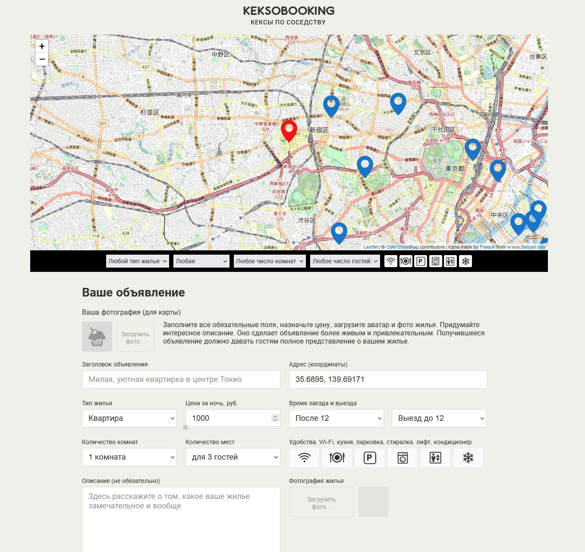

# Сайт "KeksoBooking"

## Превью сайта

## Описание проекта

Реалзовано добавление объявления, выбор точки на карте с помощью drag-n-drop, заполнение формы данных, валидация, просмотр объявлений на карте

## Технологии, использованные в проекте

* JavaScript
* Webpack
* Babel
* ESLint
* PristineJS
* Leaflet

## Ссылка на дэплой проекта

[GitHub Pages](https://mvttsun.github.io/KeksoBooking/)
